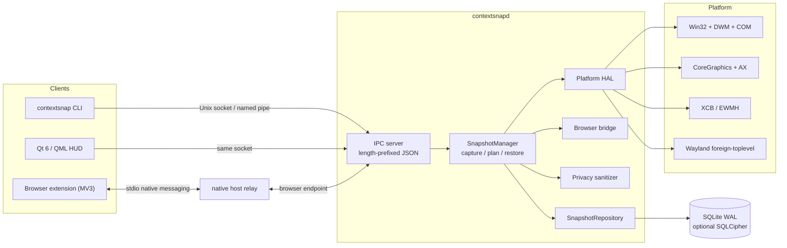
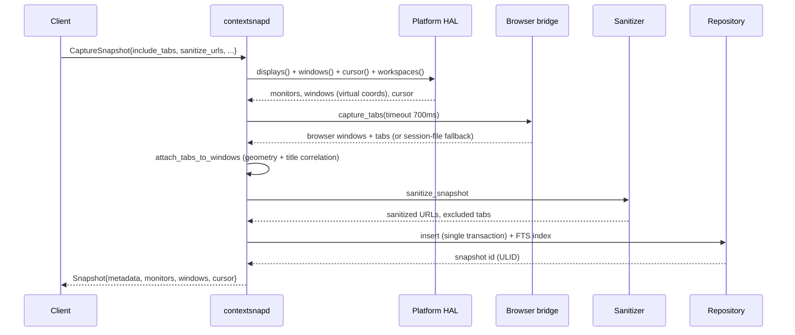

# Architecture

ContextSnap is one long-lived daemon plus thin clients. Every capability that
needs an OS permission, a browser connection or the database lives in the
daemon; the CLI, the Qt HUD and the browser extension are all clients.

## Components

| Component | Source | Responsibility |
| --- | --- | --- |
| Core types | `include/contextsnap/core/types.hpp` | Plain data: `Snapshot`, `WindowInfo`, `TabInfo`, `MonitorInfo`, `RestorePlan`, `RestoreReport`. No OS types leak in. |
| `Result<T>` | `core/result.hpp` | Error handling without exceptions across an ABI-ish boundary. Every fallible call returns it. |
| JSON | `core/json.cpp` | Dependency-free parser/serializer shared by IPC, native messaging, export and config. |
| Platform HAL | `hal/platform.hpp`, `src/hal/**` | One interface, four backends (Win32, macOS, X11, Wayland) plus a null backend for CI. Advertises a `Capabilities` struct so callers never guess. |
| Browser bridge | `browser/bridge.hpp` | Correlates browser windows to OS windows; extension first, session files as fallback. |
| Native host | `src/native_host/main.cpp` | 100-line relay: browser stdio on one side, daemon browser endpoint on the other. Runs as a child of the browser, not of the daemon. |
| Sanitizer | `privacy/sanitizer.cpp` | Strips credential-bearing URL parameters, high-entropy values, userinfo, fragments; can exclude hosts entirely. |
| Repository | `storage/snapshot_repository.cpp` | Transactional snapshot writes, FTS5 search index, pruning, id-prefix resolution. |
| Manager | `core/snapshot_manager.cpp` | Orchestration: capture pipeline, restore planning, export/import, health. |
| IPC | `ipc/*` | 4-byte little-endian length prefix + JSON body, same framing as native messaging. Same-user peer check. |

## Capture pipeline

The browser step is the only one that can be slow, so it is bounded and
optional. A capture with `include_tabs=false` never touches the browser.

## Restore pipeline

Restore is planned before it is executed, which is what makes `--dry-run`,
selective restore and honest reporting possible.

1. **Load** the snapshot and the current live state.
2. **Match** captured windows against live windows
   (`core/matching.cpp`: app id 0.40, executable 0.20, class 0.15, title 0.15,
   geometry 0.05, workspace 0.05; accept at 0.55).
3. **Plan** ordered steps: `LaunchProcess`, `WaitForWindow`, `MoveWindow`,
   `SetWindowState`, `SetWorkspace`, `RaiseWindow`, `RestoreTabs`,
   `WarpCursor`, `FocusWindow`.
4. **Filter** steps through selectors (`app:code`, `tab:*.figma.com`,
   `monitor:0`, `workspace:2`).
5. **Execute** with bounded parallel launches, per-step timeouts, and a
   `RestoreReport` that counts successes, failures and warnings instead of
   aborting on the first error.

Monitor topology is normalized into a virtual coordinate space
(`core/geometry.cpp`) so a snapshot taken on a 3-monitor desk restores sanely
on a laptop: windows whose target monitor is missing are clamped into the
nearest visible monitor rather than being placed off-screen.

## Storage

* SQLite in WAL mode, `synchronous=NORMAL`, 4 MB page cache.
* Tables: `snapshots`, `monitors`, `windows`, `tabs`, `cursor_states`,
  `restore_events`, plus the `snapshot_search` FTS5 index and the
  `snapshot_summaries` view.
* `WITHOUT ROWID` composite primary keys on the child tables keep a snapshot's
  rows physically adjacent, which is why loading one snapshot is a single
  index-ordered scan.
* Migrations are forward-only, embedded as string constants generated from
  `sql/*.sql`, and applied inside a transaction that also bumps
  `PRAGMA user_version`.
* Optional SQLCipher (AES-256-GCM) with the key stored in DPAPI / Keychain /
  Secret Service, falling back to a `0600` key file.

## Threading

| Thread | Job |
| --- | --- |
| main | IPC accept loop and request dispatch (requests are short) |
| scheduler | Interval captures, retention pruning, WAL checkpoints |
| browser | Serves the native-host relay endpoint and the tab inbox |
| restore worker | Long-running restore so the socket stays responsive |

SQLite access is serialized through the repository; the connection is opened
with a busy timeout so the scheduler and a client never deadlock.

## Failure model

Everything degrades instead of failing:

* No display server (CI, SSH) -> null HAL, capture returns an empty snapshot
  with a warning, tests still run.
* No browser extension -> session-file fallback, then no tabs, with the source
  recorded on the snapshot.
* No FTS5 in the linked SQLite -> `LIKE` search.
* No keychain -> `0600` key file with a warning.
* Missing OS permission -> reported by `missing_permissions()` and surfaced in
  `contextsnap doctor`, never as a silent no-op.
