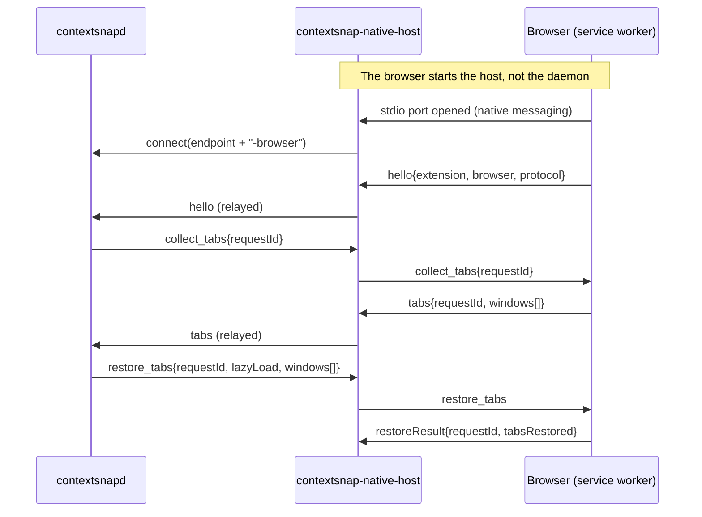

# Browser integration

Tabs are the highest-value part of a context snapshot and the only part no
operating system will tell you about. This document explains the two paths
ContextSnap uses and how to install them.

## Path 1: the extension (read + write)



Key properties:

* **The relay is a separate process.** Browsers spawn native hosts themselves
  and own their lifetime, so `contextsnap-native-host` is deliberately dumb: it
  copies frames between the browser's stdio and the daemon's browser endpoint
  (the IPC endpoint plus the `-browser` suffix). It holds no state.
* **Framing is identical on both sides** (4-byte little-endian length prefix +
  JSON), so the relay never parses a message it does not need to.
* **The daemon tolerates absence.** If no host is connected, capture falls back
  (below) and `restore_tabs` reports zero restored tabs with a warning.
* **Timeouts are short** (700 ms default) because a browser that is busy or
  asleep must not stall a capture.

### Installing the host manifest

The manifest tells the browser which binary to run and which extension may
talk to it. Paths are per-browser and per-OS:

| Browser | Location (user scope) |
| --- | --- |
| Chrome (Linux) | `~/.config/google-chrome/NativeMessagingHosts/com.contextsnap.native_host.json` |
| Chromium (Linux) | `~/.config/chromium/NativeMessagingHosts/...` |
| Edge (Linux) | `~/.config/microsoft-edge/NativeMessagingHosts/...` |
| Brave (Linux) | `~/.config/BraveSoftware/Brave-Browser/NativeMessagingHosts/...` |
| Firefox (Linux) | `~/.mozilla/native-messaging-hosts/...` |
| Chrome (macOS) | `~/Library/Application Support/Google/Chrome/NativeMessagingHosts/...` |
| Firefox (macOS) | `~/Library/Application Support/Mozilla/NativeMessagingHosts/...` |
| Chromium family (Windows) | registry `HKCU\Software\Google\Chrome\NativeMessagingHosts\com.contextsnap.native_host` pointing at a JSON file |
| Firefox (Windows) | registry `HKCU\Software\Mozilla\NativeMessagingHosts\com.contextsnap.native_host` |

`scripts/install-native-host.sh` writes the correct files for every browser it
finds; `contextsnap doctor` verifies them afterwards.

Manifest contents (generated by `browser::build_host_manifest`):

```json
{
  "name": "com.contextsnap.native_host",
  "description": "ContextSnap tab bridge",
  "path": "/usr/local/bin/contextsnap-native-host",
  "type": "stdio",
  "allowed_origins": ["chrome-extension://REPLACE_WITH_EXTENSION_ID/"]
}
```

Firefox uses `allowed_extensions: ["contextsnap@contextsnap.dev"]` instead of
`allowed_origins`. Chromium requires the trailing slash on the origin; omitting
it is the most common cause of "Access to the specified native messaging host
is forbidden".

## Path 2: session files (read only, no extension)

When no extension is connected and `allow_session_fallback` is true, the
capture reads the browser's own crash-recovery files:

| Browser | File | Format |
| --- | --- | --- |
| Chromium family | `<Profile>/Sessions/Session_<timestamp>` | SNSS: 4-byte header + length-prefixed pickled commands |
| Firefox | `<Profile>/sessionstore-backups/recovery.jsonlz4` | `mozLz40\0` + 4-byte size + raw LZ4 block, containing JSON |

Implementation notes:

* The parsers are strictly read-only and never lock the files; a torn read is
  treated as "no tabs" rather than an error.
* Firefox's container is decompressed by a small in-tree raw-LZ4 block decoder
  (`decompress_mozlz4`), so no `liblz4` dependency is required for the common
  case.
* SNSS parsing extracts `CommandUpdateTabNavigation` and
  `CommandSetSelectedTabInIndex` records; profile discovery reads
  `Local State` (Chromium) and `profiles.ini` (Firefox).
* Data can be up to one flush interval stale, and the fallback cannot restore
  anything. The snapshot records `source: session_file` so the UI can say so.

## Correlating tabs with OS windows

Browser windows reported by the extension have their own ids, which are
meaningless to the window manager. `browser::attach_tabs_to_windows` runs two
passes:

1. **Geometry match** - browser window frame against OS window rect within a
   tolerance, restricted to windows whose process is that browser.
2. **Title match** - the active tab's title usually appears in the OS window
   title, so the remaining windows are matched on normalized title similarity.

Unmatched browser windows are still stored (as windows with tabs but no OS
handle) so nothing is lost; unmatched OS browser windows simply carry no tabs.

## Restoring tabs without melting the machine

* Default is lazy: Firefox accepts `discarded: true` at creation, Chromium
  requires create-then-`tabs.discard`, which the extension does for every
  non-active tab.
* Windows are created first with their geometry, then tabs are appended in
  index order, then the originally active tab is re-selected.
* Pinned tabs are restored first and get a higher `restore_priority` in the
  database so partial restores keep the useful tabs.
* Private/incognito windows are skipped unless explicitly enabled, and
  Chromium additionally requires the user to allow the extension in incognito.

## Privacy

All sanitization happens in the daemon (`src/privacy/sanitizer.cpp`) before
tabs are written, so there is exactly one place to audit. The extension has no
content script, no host permissions and no network access; it cannot read page
content even if it wanted to.
